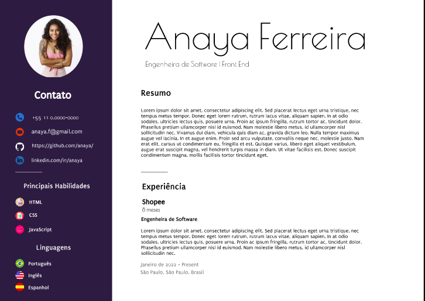

# Cover Letter

Projeto criado para fins didáticos no ensino de alunos da +1code

Nesse projeto fora utilizados:
- Fonte parágrafos e títulos ***[Puritan](https://fonts.google.com/specimen/Puritan)***
- Fonte nome e ocupação ***[Poiret One](https://fonts.google.com/specimen/Poiret+One)***
- Ícones ***[Flat Icon](https://www.flaticon.com/br/)***
- Fotos ***[Freepik](https://br.freepik.com/)***

Abaixo, temos o resultado esperado após a conclusão do projeto

